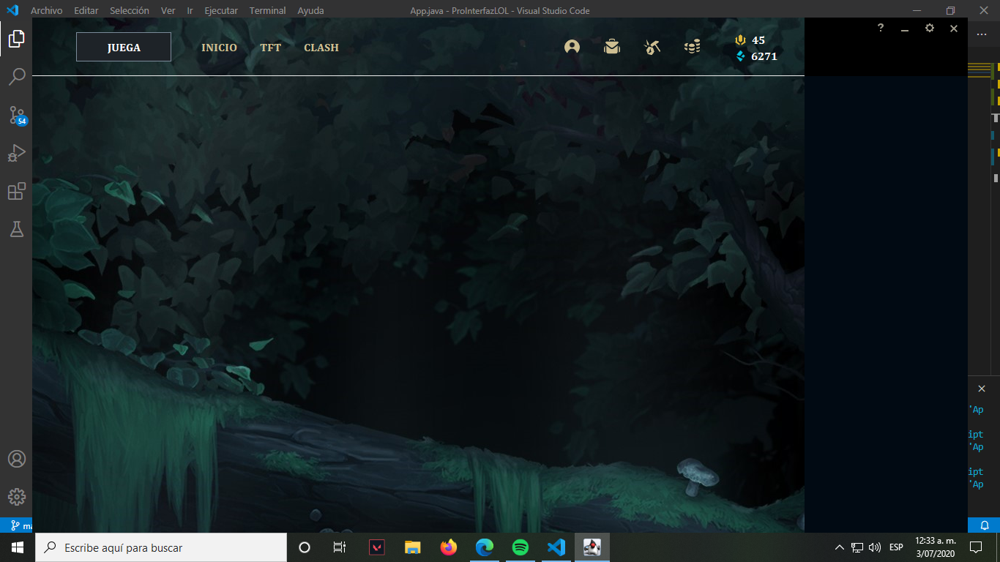
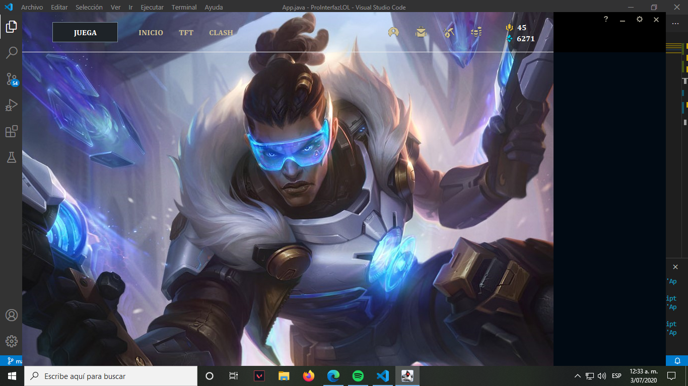
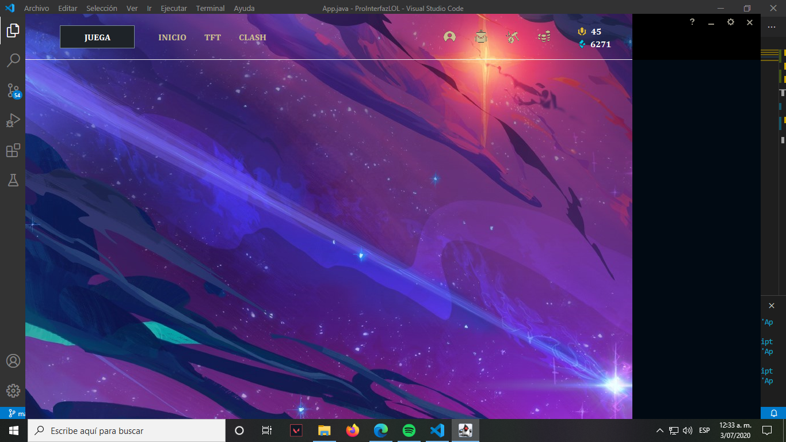
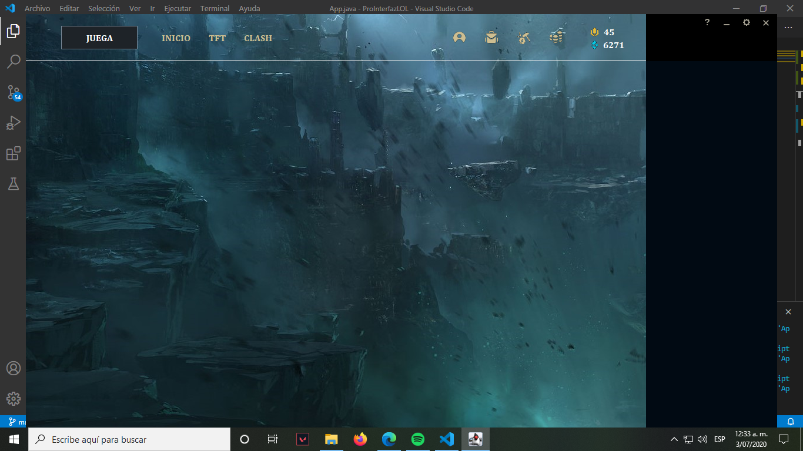
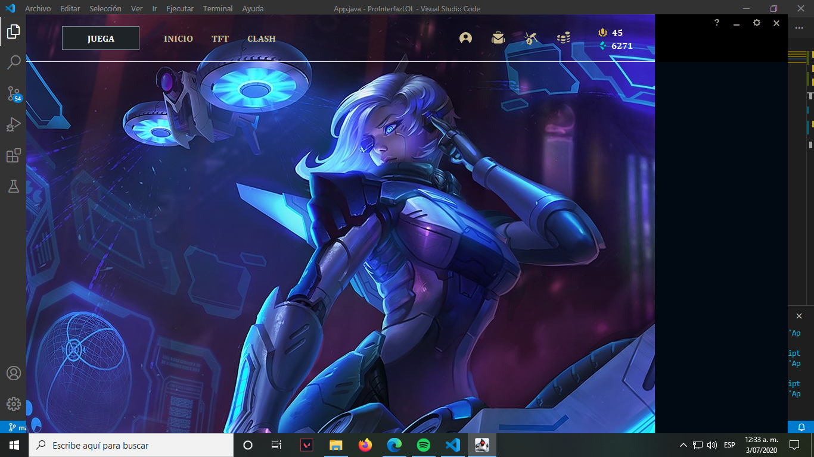
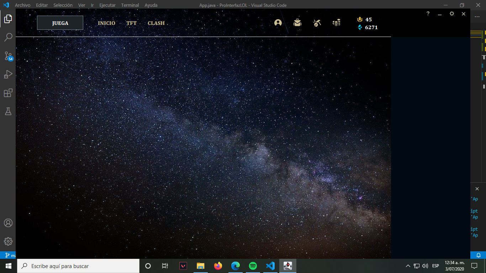
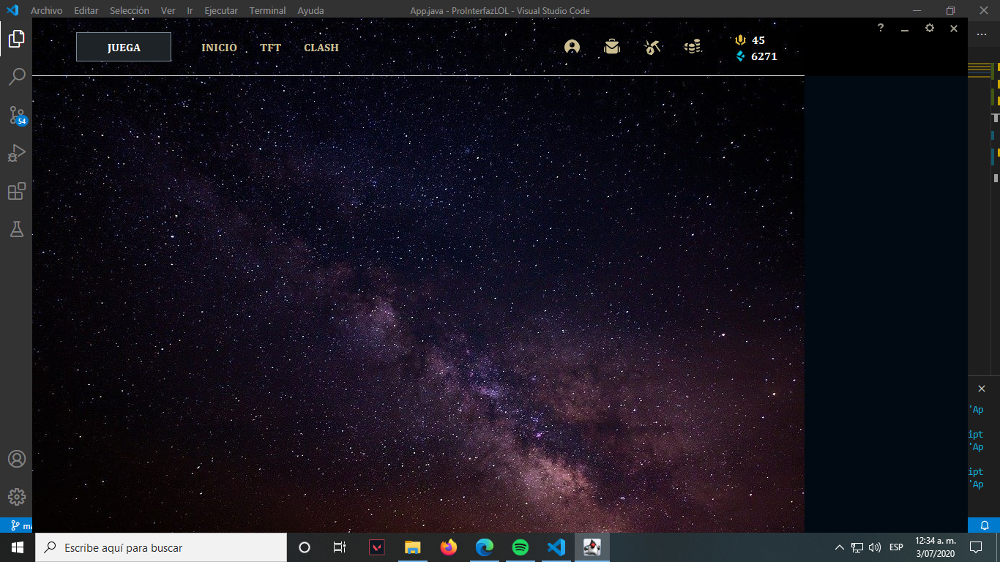
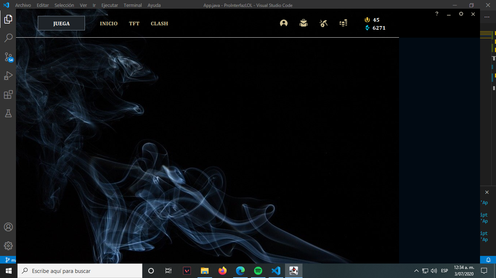

# Actividad # 6 - Incorporacion de componentes graficos
## Josue Nuñez Prada
Se realiza la incorporación de componentes gráficos sobre la ventana principal el enrutamiento para controlar la creación de objetos en memoria de los componentes.

Vista principal con componente Juega

Vista principal con componente Inicio

Vista principal con componente TFT

Vista principal con componente Clash

Vista principal con componente Perfil

Vista principal con componente Coleccion

Vista principal con componente Botin

Vista principal con componente Tienda

Este repositorio contiene el codigo de la sexta actividad, correspondiente a la incorporacion de componentes graficos

